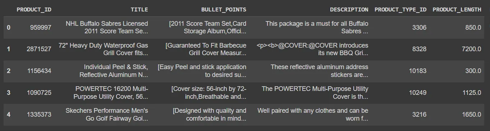
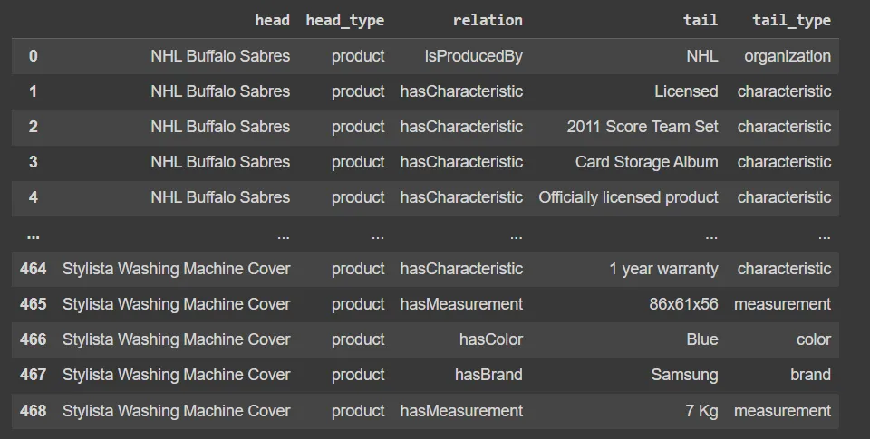
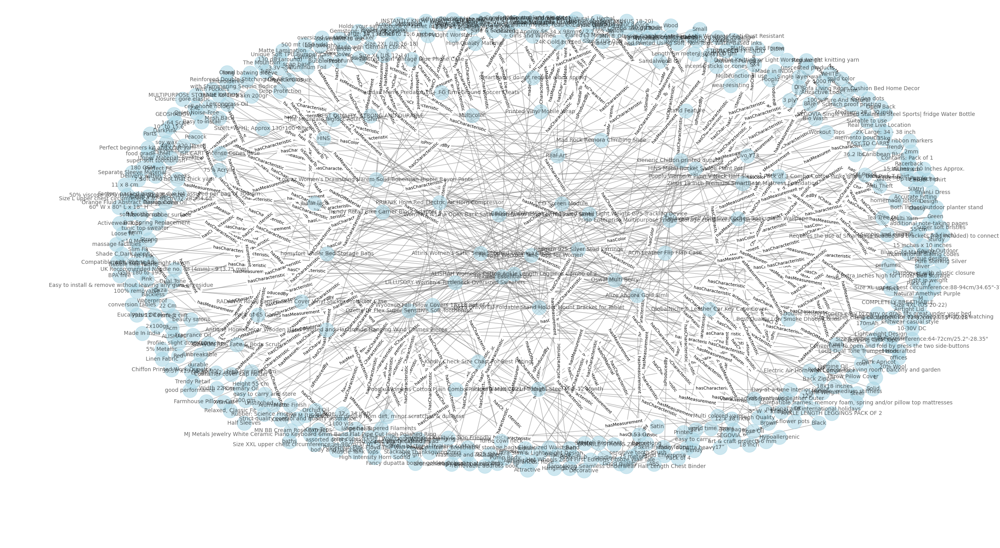

# 使用 ChatGPT 自动化知识图构建

## 介绍：

在本文中，我们将讨论使用 OpenAI 的 gpt-3.5-turbo 从原始文本数据构建知识图谱的主题。大型语言模型（LLMs）在文本生成和问答任务中表现出卓越性能。检索增强生成（RAG）进一步提高了它们的性能，使它们能够访问最新的领域特定知识。本文的目标是利用LLMs作为信息提取工具，将原始文本转化为可以轻松查询以获取有用见解的事实。但首先，我们需要定义一些关键概念。

## 什么是知识图谱？

知识图谱是一个语义网络，代表并互联现实世界的实体。这些实体通常对应于人物、组织、物体、事件和概念。知识图谱由具有以下结构的三元组组成：

**头部 → 关系 → 尾部**

或者在语义网络术语中：

**主语 → 谓词 → 宾语**

网络表示使我们能够提取和分析这些实体之间存在的复杂关系。

知识图谱通常伴随着概念、关系和其属性的定义，即本体。本体是一个正式的规范，定义了目标领域中的概念及其关系，从而为网络提供语义。

在 Web 上，搜索引擎和其他自动化代理使用本体来理解特定 Web 页面的内容，以便索引并正确显示它。

## 案例描述：

在这个用例中，我们将使用 OpenAI 的 gpt-3.5-turbo 从[亚马逊产品数据集](https://www.kaggle.com/datasets/piyushjain16/amazon-product-data)的产品描述中创建知识图谱。

Web 上有很多用于描述产品的本体，最流行的是 Good Relations Ontology 和 Product Types Ontology 。[这两个本体都扩展了Schema.org](http://xn--schema-hu7isb41dt2duw8dqipzsoel8kjud.org/) Ontology。

[Schema.org](http://Schema.org) 是一个协同活动，旨在创建、维护和推广互联网上结构化数据的模式。Schema.org词汇可以使用许多不同的编码，包括 RDFa、Microdata 和 JSON-LD。

对于当前的任务，我们将使用 [Schema.org](http://Schema.org) 对产品及其相关概念的定义，包括它们的关系，从产品描述中提取三元组。

## 实施：

我们将在 Python 中实现这个解决方案。首先，我们需要安装和导入所需的库。

**导入库并读取数据：**

```python
pip install -r requirements.txt -i https://pypi.mirrors.ustc.edu.cn/simple/
```

```python
import json
import logging
import matplotlib.pyplot as plt
import networkx as nx
from networkx import connected_components
import pandas as pd
from sentence_transformers import SentenceTransformer, util
```

现在，我们将亚马逊产品数据集读取为一个pandas数据框。

```python
data = pd.read_csv("./data/amazon_products.csv")
```

我们可以在下图中看到数据集的内容。数据集包含以下列：'PRODUCT_ID'、'TITLE'、'BULLET_POINTS'、'DESCRIPTION'、'PRODUCT_TYPE_ID'和'PRODUCT_LENGTH'。我们将合并'TITLE'、'BULLET_POINTS'和'DESCRIPTION'列到一个名为'text'的列中，这将代表我们将提示ChatGPT从中提取实体和关系的产品规格。



```python
data['text'] = data['TITLE'] + data['BULLET_POINTS'] + data['DESCRIPTION']
```

## 信息提取：

我们将指示ChatGPT从提供的产品规格中提取实体和关系，并将结果作为 JSON 对象数组返回。JSON 对象必须包含以下键：'head'、'head_type'、'relation'、'tail'和'tail_type'。

'head'键必须包含从用户提示中提供的类型之一的提取实体的文本。'head_type'键必须包含提取的头实体的类型，该类型必须是从提供的用户列表中的类型之一。'relation'键必须包含'head'和'tail'之间的关系类型，'tail'键必须表示三元组中的对象的提取实体的文本，'tail_type'键必须包含尾部实体的类型。

我们将使用下面列出的实体类型和关系类型提示 ChatGPT 进行实体-关系提取。我们将这些实体和关系映射到 [Schema.org](http://Schema.org) 本体的相应实体和关系。映射中的键表示提供给 ChatGPT 的实体和关系类型，值表示 Schema.org 中对象和属性的 URLS。

```python
# ENTITY TYPES:
entity_types = {
  "product": "https://schema.org/Product", 
  "rating": "https://schema.org/AggregateRating",
  "price": "https://schema.org/Offer", 
  "characteristic": "https://schema.org/PropertyValue", 
  "material": "https://schema.org/Text",
  "manufacturer": "https://schema.org/Organization", 
  "brand": "https://schema.org/Brand", 
  "measurement": "https://schema.org/QuantitativeValue", 
  "organization": "https://schema.org/Organization",  
  "color": "https://schema.org/Text",
}

# RELATION TYPES:
relation_types = {
  "hasCharacteristic": "https://schema.org/additionalProperty",
  "hasColor": "https://schema.org/color", 
  "hasBrand": "https://schema.org/brand", 
  "isProducedBy": "https://schema.org/manufacturer", 
  "hasColor": "https://schema.org/color",
  "hasMeasurement": "https://schema.org/hasMeasurement", 
  "isSimilarTo": "https://schema.org/isSimilarTo", 
  "madeOfMaterial": "https://schema.org/material", 
  "hasPrice": "https://schema.org/offers", 
  "hasRating": "https://schema.org/aggregateRating", 
  "relatedTo": "https://schema.org/isRelatedTo"
 }

```

为了使用 ChatGPT 执行信息提取，我们创建一个 OpenAI 客户端，并使用聊天完成 API 从原始产品规格生成 JSON 对象数组的输出。

```python
def extract_information(self, message, history):
        # 1.组装系统提示，历史对话，用户当前问题
        system_prompt = prompt.SIMPLE_SYSTEM_PROMPT
        
        # 2.组装图谱提示
        graph_prompt = prompt.SIMPLE_GRAPH_PROMPT.format(
            entity_types=types_enum.entity_types,
            relation_types=types_enum.relation_types,
            specification=message
        )

        messages = self.util.concat_chat_message(system_prompt, history, graph_prompt)

        # 2. 去调用 OpenAI 的接口完成任务
        response = self.util.ChatOpenAI(messages)

        return response.content

```

## 提示工程：

system_prompt 变量包含指导 ChatGPT 从原始文本中提取实体和关系，并以 JSON 对象数组的形式返回结果的指令。

user_prompt 变量包含数据集中单个规格所需输出的示例，并提示 ChatGPT 以相同的方式从提供的规格中提取实体和关系。这是 ChatGPT 的单次学习的示例。

```python
SIMPLE_SYSTEM_PROMPT = """You are an expert agent specialized in analyzing product specifications in an online retail store.
Your task is to identify the entities and relations requested with the user prompt, from a given product specification.
You must generate the output in a JSON containing a list with JOSN objects having the following keys: "head", "head_type", "relation", "tail", and "tail_type".
The "head" key must contain the text of the extracted entity with one of the types from the provided list in the user prompt, the "head_type"
key must contain the type of the extracted head entity which must be one of the types from the provided user list,
the "relation" key must contain the type of relation between the "head" and the "tail", the "tail" key must represent the text of an
extracted entity which is the tail of the relation, and the "tail_type" key must contain the type of the tail entity. Attempt to extract as
many entities and relations as you can.
"""

```

现在，我们为数据集中的每个规格调用 extract_information 函数，并创建包含所有提取的三元组的列表，这将代表我们的知识图谱。对于这个演示，我们将仅使用100个产品规格的子集生成一个知识图谱。

```python
SIMPLE_GRAPH_PROMPT = """Based on the following example, extract entities and relations from the provided text.
Use the following entity types:

# ENTITY TYPES:
{entity_types}

Use the following relation types:
{relation_types}

--> Beginning of example

# Specification
"YUVORA 3D Brick Wall Stickers | PE Foam Fancy Wallpaper for Walls,
 Waterproof & Self Adhesive, White Color 3D Latest Unique Design Wallpaper for Home (70*70 CMT) -40 Tiles
 [Made of soft PE foam,Anti Children's Collision,take care of your family.Waterproof, moist-proof and sound insulated. Easy clean and maintenance with wet cloth,economic wall covering material.,Self adhesive peel and stick wallpaper,Easy paste And removement .Easy To cut DIY the shape according to your room area,The embossed 3d wall sticker offers stunning visual impact. the tiles are light, water proof, anti-collision, they can be installed in minutes over a clean and sleek surface without any mess or specialized tools, and never crack with time.,Peel and stick 3d wallpaper is also an economic wall covering material, they will remain on your walls for as long as you wish them to be. The tiles can also be easily installed directly over existing panels or smooth surface.,Usage range: Featured walls,Kitchen,bedroom,living room, dinning room,TV walls,sofa background,office wall decoration,etc. Don't use in shower and rugged wall surface]
Provide high quality foam 3D wall panels self adhesive peel and stick wallpaper, made of soft PE foam,children's collision, waterproof, moist-proof and sound insulated,easy cleaning and maintenance with wet cloth,economic wall covering material, the material of 3D foam wallpaper is SAFE, easy to paste and remove . Easy to cut DIY the shape according to your decor area. Offers best quality products. This wallpaper we are is a real wallpaper with factory done self adhesive backing. You would be glad that you it. Product features High-density foaming technology Total Three production processes Can be use of up to 10 years Surface Treatment: 3D Deep Embossing Damask Pattern."

################

# Output
[
  {{
    "head": "YUVORA 3D Brick Wall Stickers",
    "head_type": "product",
    "relation": "isProducedBy",
    "tail": "YUVORA",
    "tail_type": "manufacturer"
  }},
  {{
    "head": "YUVORA 3D Brick Wall Stickers",
    "head_type": "product",
    "relation": "hasCharacteristic",
    "tail": "Waterproof",
    "tail_type": "characteristic"
  }},
  {{
    "head": "YUVORA 3D Brick Wall Stickers",
    "head_type": "product",
    "relation": "hasCharacteristic",
    "tail": "Self Adhesive",
    "tail_type": "characteristic"
  }},
  {{
    "head": "YUVORA 3D Brick Wall Stickers",
    "head_type": "product",
    "relation": "hasColor",
    "tail": "White",
    "tail_type": "color"
  }},
  {{
    "head": "YUVORA 3D Brick Wall Stickers",
    "head_type": "product",
    "relation": "hasMeasurement",
    "tail": "70*70 CMT",
    "tail_type": "measurement"
  }},
  {{
    "head": "YUVORA 3D Brick Wall Stickers",
    "head_type": "product",
    "relation": "hasMeasurement",
    "tail": "40 tiles",
    "tail_type": "measurement"
  }},
  {{
    "head": "YUVORA 3D Brick Wall Stickers",
    "head_type": "product",
    "relation": "hasMeasurement",
    "tail": "40 tiles",
    "tail_type": "measurement"
  }}
]

--> End of example

For the following specification, generate extract entitites and relations as in the provided example.

# Specification
{specification}
################

# Output

"""

```

信息提取的结果如下图所示：



## 实体解析：

实体解析（ER）是将对应于现实世界概念的实体消歧的过程。在这种情况下，我们将尝试对数据集中的头部和尾部实体执行基本的实体解析。这样做的原因是为了对文本中存在的事实进行更简洁的表示。

我们将使用 NLP 技术进行实体解析，具体来说，我们将为每个头部创建嵌入，使用 sentence-transformers 库，并计算头部实体之间的余弦相似度。

我们将使用 'all-MiniLM-L6-v2' 句子转换器创建嵌入，因为它是一种快速且相对准确的模型，适用于这个用例。对于每一对头部实体，我们将检查相似度是否大于0.95，如果是，我们将考虑这些实体为同一实体，并将它们的文本值归一化为相等。对尾部实体也是同样的道理。

这个过程将帮助我们实现以下结果。如果我们有两个实体，一个值为 'Microsoft' ，第二个值为 'Microsoft Inc.'，那么这两个实体将合并成一个。

我们以以下方式加载和使用嵌入模型来计算第一个和第二个头部实体之间的相似度。

```python
heads = kg_relations['head'].values
embedding_model = SentenceTransformer('all-MiniLM-L6-v2')
embeddings = embedding_model.encode(heads)
similarity = util.cos_sim(embeddings[0], embeddings[1])
```

为了在实体解析后可视化提取的知识图谱，我们使用 Python 库 networkx。首先，我们创建一个空图，并将每个提取的关系添加到图中。

```python
G = nx.Graph()
for _, row in kg_relations.iterrows():
  G.add_edge(row['head'], row['tail'], label=row['relation'])
```

为了绘制图表，我们可以使用以下代码：

```python
pos = nx.spring_layout(G, seed=47, k=0.9)
labels = nx.get_edge_attributes(G, 'label')
plt.figure(figsize=(15, 15))
nx.draw(G, pos, with_labels=True, font_size=10, node_size=700, node_color='lightblue', edge_color='gray', alpha=0.6)
nx.draw_networkx_edge_labels(G, pos, edge_labels=labels, font_size=8, label_pos=0.3, verticalalignment='baseline')
plt.title('Product Knowledge Graph')
plt.show()
```

可以在下图中看到生成的知识图谱的子图：



通过这种方式，我们可以连接具有共同特征的多个不同产品。这对于学习产品之间的共同属性、规范化产品规格、使用 [Schema.org](http://Schema.org) 等通用模式描述 Web 上的资源，甚至基于产品规格进行产品推荐非常有用。

## 结论：

大多数公司在数据湖中有大量未使用的非结构化数据。创建知识图谱以从这些未处理和非结构化的文本语料库中提取见解的方法将有助于获取被困在其中的信息，并将其用于做出更明智的决策。

到目前为止，我们已经看到LLMs可以用于从原始文本数据中提取实体和关系的三元组，并自动构建知识图谱。在下一篇文章中，我们将尝试基于提取的知识图谱创建一个产品推荐系统。

## 其他说明
- [亚马逊产品数据集](https://www.kaggle.com/datasets/piyushjain16/amazon-product-data)
- [Azure OpenAI 服务申请入口](https://azure.microsoft.com/zh-cn/products/ai-services/openai-service/)


